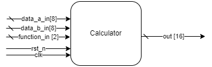

# UVM_calculator

## Project Description

This repository is meant for learning UVM using SystemVerilog. Through a verification environment, some hardware verification concepts are applied for a calculator with the four basic operations.

## 🔨 Project Features

This project is capable of performing functional verification of a simple calculator (that performs the four basic arithmetic operations) developed in Systemverilog by creating a verification environment developed according to the UVM methodology.

## ✔️ Techniques and technologies used

- `Systemverilog`
- `UVM`
- `Functional Verification`
- `Simulation of a verification environment`

## 📁 Access to the project

You can [download the project's source code](https://github.com/MarleyLobao/UVM_calculator.git).

## 🛠️ Execute the project

The Makefile in the `tb/rundir/` directory has the following options:
- `make sim`: Run the project with Xcelium Logic Simulator from Cadence;
- `make gui`: Run the simulation using Simvision's GUI.

When you run `calculator_test` you should notice at the end of the log that all the results match with the reference model and the planned coverage has been achieved 🏆 

## 📚 More about me

`in` [My LinkedIn](https://www.linkedin.com/in/marley-lobao-de-sousa/)
