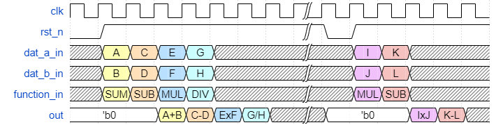

# Calculator

## **Module Description**

*Calculator* is a simple design, non-synthesizable written for UVM-study purposes.
The following image, depicts the block interface, followed by its ports description. 

## **Interface Details**

| Portname        | Direction | Note 
|:--------       |:--------- |:-----
| clk             | input     | clock
|rst_n            | input     | async, active-low
|function_in[1:0] | input     | opcodes are:   00: SUM => A+B   01: SUB => A-B   10: MUL => A\*B   11: DIV => A/B
|dat_a_in[7:0]    | input | signed 8-bit numbers [-128,127]
|dat_b_in[7:0]    | input | signed 8-bit numbers [-128,127]
|out[15:0]        | ouput | signed 16-bit numbers [-32'768,32'767]

## **Waveforms**

## **Important Features**

In the specific situation where the operation is a division (function_in[1:0] = 2'b11) and the operator B is zero (dat_b_in[7:0] == 8'b0), there is a saturation to:

- If the result is *greater* than can be represented with 16 bits with sign: 16'd32767

- If the result is *smaller* than can be represented with 16 bits with sign: -16'd32768
